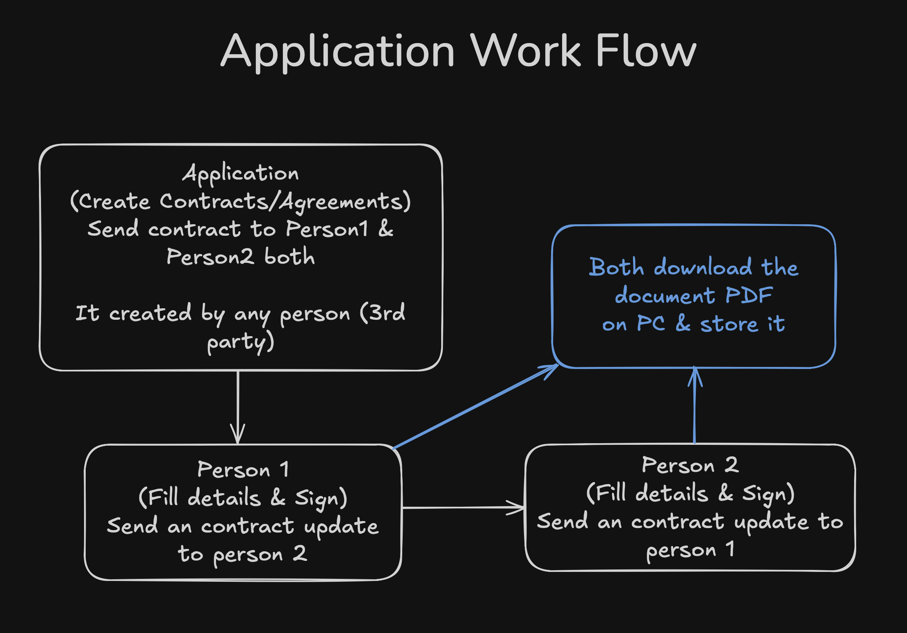

# 📄 Paperless HQ  

Paperless HQ is a modern platform that helps teams and individuals manage, sign, and store documents digitally — eliminating the hassle of printing, scanning, and physical paperwork.  

---

## ✨ Features  
- 📄 Upload and manage documents securely  
- 🖊️ Digital signatures support  
- 👥 Team collaboration and document sharing  
- 🔐 Role-based access control  
- ☁️ Cloud storage integration  
- 📊 Dashboard for tracking document status  

---

## 🚀 Tech Stack  
- **Frontend:** Next.js, Tailwind CSS, ShadCN  
- **Backend:** Node.js / Express (or Next.js API routes)  
- **Database:** PostgreSQL + Prisma ORM  
- **Infrastructure:** AWS, Docker, Kubernetes  
- **Others:** Recoil (state management), Framer Motion (UI animations)  

---

  
